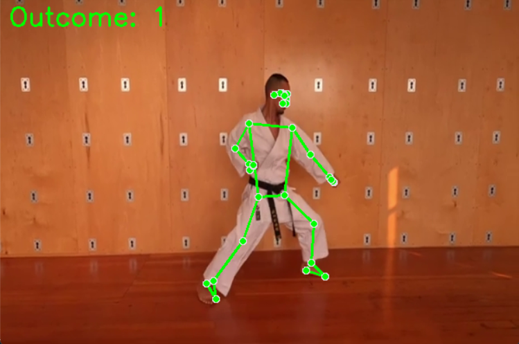

# Real-time Detection of Taikyoku Shodan Karate Kata Poses Using Classical Machine Learning and Deep Learning Models

Welcome to the Karate Summer 23 Project! This repository contains all the code and resources related to my project focused on Karate training and analysis.

## Table of Contents
- [Introduction](#introduction)
- [Features](#features)
- [Demo](#demo)
- [Installation](#installation)
- [Usage](#usage)
- [Database and Pre-trained Models](#database-and-pre-trained-models)
- [Publication](#publication)
- [Contributing](#contributing)
- [License](#license)
- [Contact](#contact)
- [Acknowledgements](#acknowledgements)
- [Detailed Research](#detailed-research)
  - [Data Collection and Preprocessing](#data-collection-and-preprocessing)
  - [Models Selection and Training](#models-selection-and-training)
  - [Evaluation](#evaluation)
  - [Results](#results)
  - [Future Work](#future-work)

## Introduction

The Karate Summer 23 Project aims to enhance Karate training using advanced technologies. This project integrates various techniques to analyze and improve the performance of Karate practitioners. The system provides real-time feedback on Karate techniques using machine learning (ML) and deep learning (DL) models.

The focus is specifically on the Taikyoku Shodan Karate Kata, covering the 20 sequential moves in this kata to provide precise feedback and improve practitioners' techniques.


## Features

- **Real-time Analysis:** Uses advanced algorithms to provide real-time feedback on Karate techniques.
- **Comprehensive Data Collection:** Collects detailed data on movements and performance metrics.
- **User-friendly Interface:** Provides an intuitive interface for users to interact with the system.
- **Advanced ML & DL Models:** Utilizes a range of models, including Random Forest, MLP, KNN, CNN, RNN, LSTM, and CNN-LSTM, to achieve high accuracy in pose detection.

## Demo
Run Example



## Installation

Follow these steps to set up the project on your local machine:

### Prerequisites:
- Python 3.x
- OpenCV
- TensorFlow
- NumPy

### Steps

```sh
# Clone the Repository
git clone https://github.com/mazen251/Karate-Summer-23-Project-.git
cd Karate-Summer-23-Project-

# Install Dependencies
pip install -r requirements.txt

# Run the Application
python main.py
```

## Usage

Once the application is installed, you can run it using the command above. The system will analyze the movements and provide feedback based on the data collected.

## Database and Pre-trained Models

This project uses several pre-trained models and datasets to analyze Karate techniques. Detailed information on these models can be found in the `models/` directory.

## Publication

This project was published as part of an IEEE paper:
- **Title:** [Real-time Detection of Taikyoku Shodan Karate Kata Poses Using Classical Machine Learning and Deep Learning Models](https://ieeexplore.ieee.org/document/10278373)
- **Authors:** Mazen Walid, Mostafa Ameen, Ayman Atia
- **Conference:** [2023 International Mobile, Intelligent, and Ubiquitous Computing Conference (MIUCC)](https://ieeexplore.ieee.org/xpl/conhome/10278292/proceeding)
- **Date:** 6-7 March 2023
- **Abstract:** The research discusses the necessity for a precise feedback karate training system utilizing ML and DL models to facilitate real-time pose detection by offering instantaneous and accurate feedback. The system has the potential to revolutionize training methodologies, improve performance, and make significant contributions to the field of martial arts research. Various ML & DL algorithms were explored to achieve optimal results. Among the classical ML methods, the Random Forest, attained an accuracy of 98%. Additionally, DL models were also examined, with the Long-Short term memory model achieving an accuracy of 97%.

## Contributing

We welcome contributions to enhance this project. To contribute, please follow these steps:

1. Fork the repository.
2. Create a new branch (`git checkout -b feature/your-feature`).
3. Commit your changes (`git commit -m 'Add some feature'`).
4. Push to the branch (`git push origin feature/your-feature`).
5. Open a pull request.

## License

This project is licensed under the MIT License. See the `LICENSE` file for more details.

## Contact

For any inquiries or further information, please contact:

Mazen Walid - [LinkedIn](https://www.linkedin.com/in/mazen-walid-225582208/)

## Acknowledgements
- [Misr International University](https://miuegypt.edu.eg/)
- [IEEE](https://www.ieee.org/)
- [OpenCV](https://opencv.org/)
- [TensorFlow](https://www.tensorflow.org/)
- MediaPipe

## Detailed Research

### Data Collection and Preprocessing

The dataset was created by collecting videos of people performing the "Taikyoku Shodan" kata, and extensive data preprocessing was performed to extract the required features. The Mediapipe library was used for landmark extraction, converting the video frames into numerical CSV files for model training.

### Models Selection and Training

The research explored various ML and DL models:
- **Random Forest (RF):** Achieved 98% accuracy.
- **K-Nearest Neighbor (KNN):** Achieved 96% accuracy.
- **Multi-layer Perceptron (MLP):** Achieved 76% accuracy.
- **Convolutional Neural Networks (CNN):** Achieved 92% accuracy.
- **Recurrent Neural Networks (RNN):** Achieved 97% accuracy.
- **Long Short-Term Memory (LSTM):** Achieved 97% accuracy.
- **CNN-LSTM:** Achieved 94% accuracy.

### Evaluation

The models were evaluated based on accuracy, precision, recall, and F1 score. The Random Forest model showcased competitive performance across all metrics, making it a highly effective choice for real-time pose detection.

### Results

The system provides real-time feedback by displaying the skeleton of the performer in green for correct poses and red for incorrect ones. A pose number is displayed during the sequence, and a percentage value indicating overall accuracy is shown upon completion.

### Future Work

Future research can focus on expanding the dataset, refining the models, developing an intuitive user interface, conducting longitudinal studies, and collaborating with other researchers to enhance the system's effectiveness.
